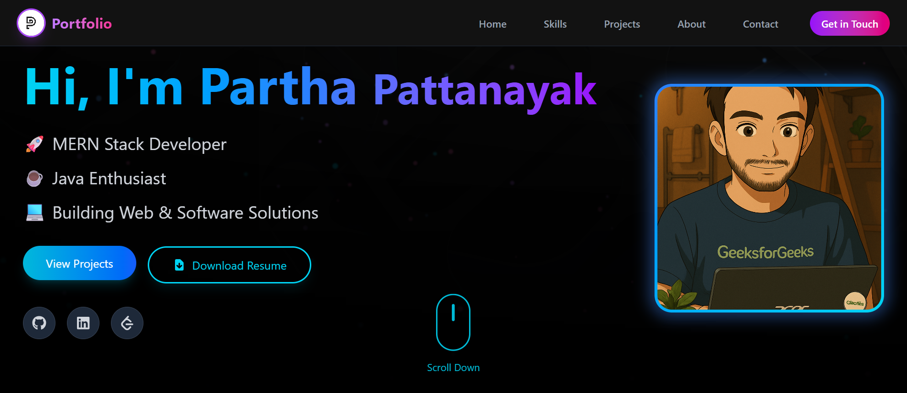
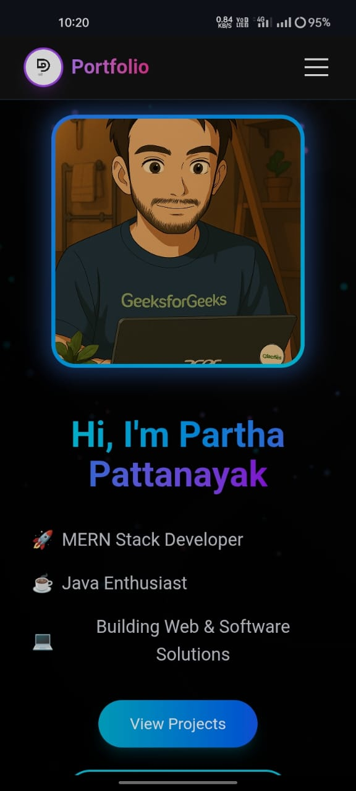

# 🌐 Partha Pattanayak — Portfolio Website

Welcome to my personal developer portfolio — built with **React + Vite** and styled using **Tailwind CSS**. This website showcases my skills, projects, and contact information in an animated, responsive, and interactive experience.

---

## 🔗 Live Demo

👉 [Check it out here](https://partha-portfolio-02.vercel.app/)

---

## 📸 Screenshots

| Desktop View                              | Mobile View                              |
| ----------------------------------------- | ---------------------------------------- |
|  |  |

---

## ✨ Features

- 💻 Built with React and Vite for fast performance
- 🎨 Tailwind CSS for rapid styling and custom design
- 🌌 Particle background
- ✨ Framer Motion for smooth entrance animations
- 📱 Fully responsive (mobile-friendly)
- 🧠 Skills, Projects, About, and Contact sections
- 📩 Contact form powered by [EmailJS](https://www.emailjs.com/)
- 🔍 Project modal previews with GitHub & Live links
- 🚀 Deployed on Vercel

---

## 🛠️ Tech Stack

- **Frontend:** React, Vite, Tailwind CSS, Framer Motion
- **Email Integration:** EmailJS
- **Deployment:** Vercel
- **Icons & Animations:** React Icons

---

## 📦 Installation & Running Locally

- Clone the repo :

```bash
git clone https://github.com/PARTHA-PATTANAYAK-02/Portfolio_Website.git
cd Portfolio_Website
```

### 📦 Installation & Setup

```bash
npm install
```

### Set up environment variables

- Create a .env file in the root directory:

```bash
VITE_SERVICE_ID=your_service_id
VITE_TEMPLATE_ID=your_template_id
VITE_PUBLIC_KEY=your_public_key
```

### Start the development server

```bash
npm run dev
```

---

## 🌐 Deployment

Deploy the project with Vercel by importing the repository. Vercel detects Vite
automatically; use `npm run build` as the build command and `dist` as the output
directory if prompted. Add `VITE_SERVICE_ID`, `VITE_TEMPLATE_ID`, and
`VITE_PUBLIC_KEY` to the project's environment variables, then redeploy so the
contact form can send messages.

- ### 🔗 [Vercel](https://partha-portfolio-02.vercel.app/)

## ✍️ Author

### Made with ❤️ by Partha Pattanayak

- 🔗[Github](https://github.com/PARTHA-PATTANAYAK-02)
- 🔗[LinkedIn](https://www.linkedin.com/in/iampartha02/)
